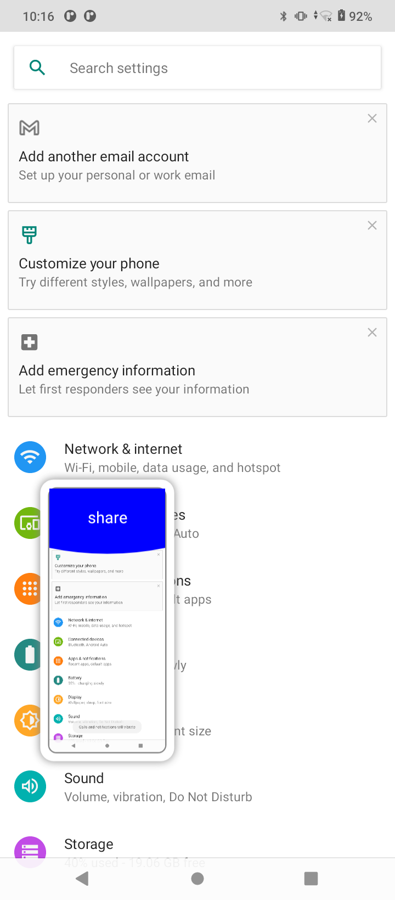
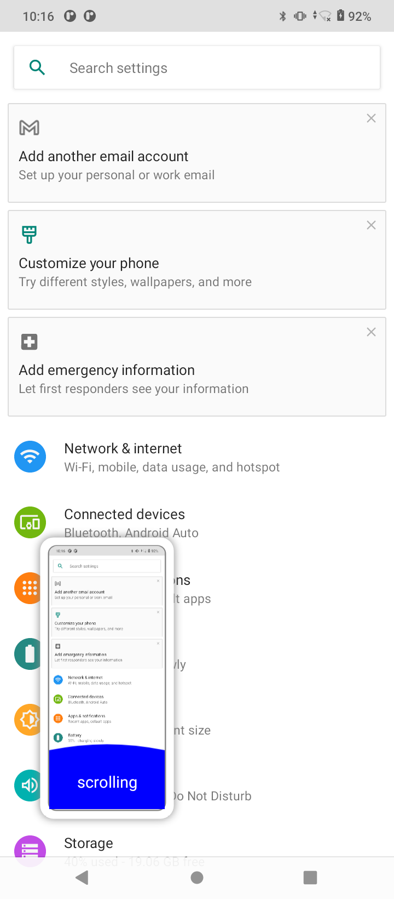

# Scroll ScreenShot;

# opencv ImageStitcher
Android 手机,可滚动截屏,实现长截图的功能；
也可手动截图后,进行拼接,实现长图;

## 自动滚动截屏,生成长图:

## 手动截图后对图片进行拼接生成长图:

此应用需要root 权限,系统签名才能安装；

 开启截图服务
        Intent screenshotIntent = new Intent(this,TakeScreenshotService.class);
        startService(screenshotIntent);
截图会在屏幕左下角生成缩略图；
缩略图可以上下左右滑动；
向上滑动 -- share 分享图片
向下滑动 -- Scroll 开启滚动截屏
向左滑动-- save 保存图片
向右滑动--delete 删除截图
点击 -- 对截图进行编辑；

### 向上滑动

### 向下滑动

 # 主要功能: 使用opencv 对截取的图片进行拼接,从而实现长图功能;

有问题咨询可邮件;
liutao3325@gmail.com;
